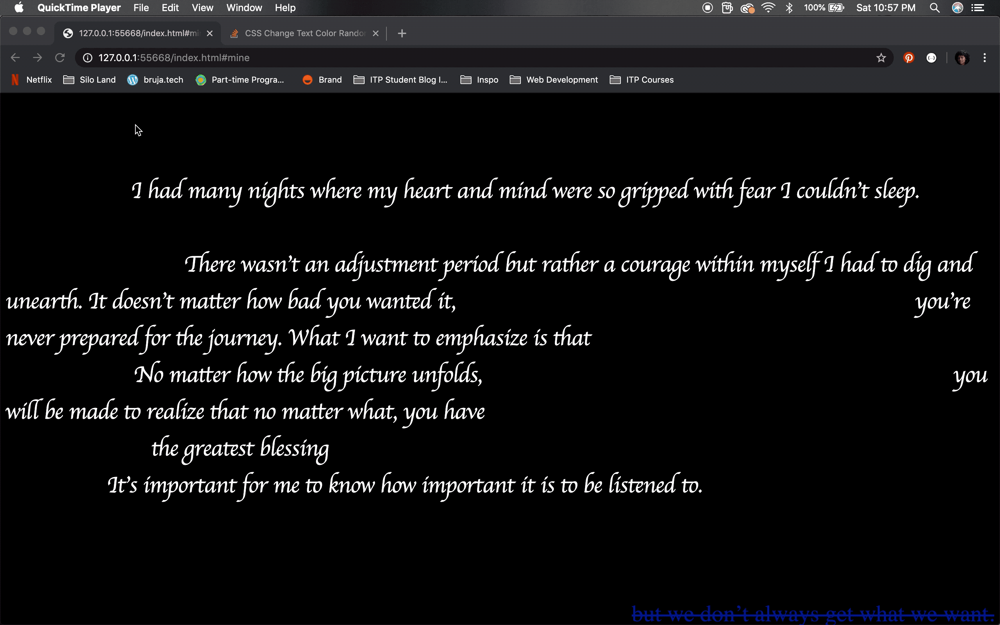
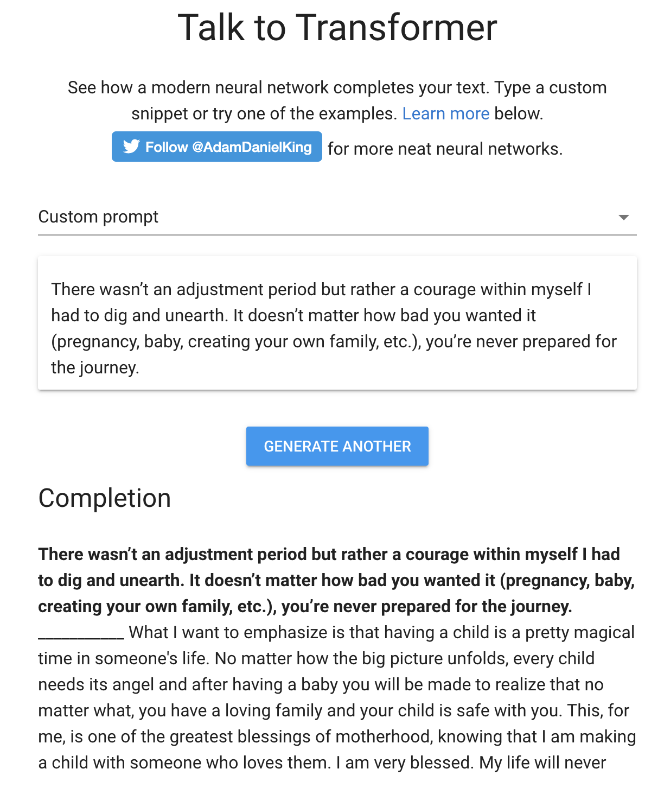
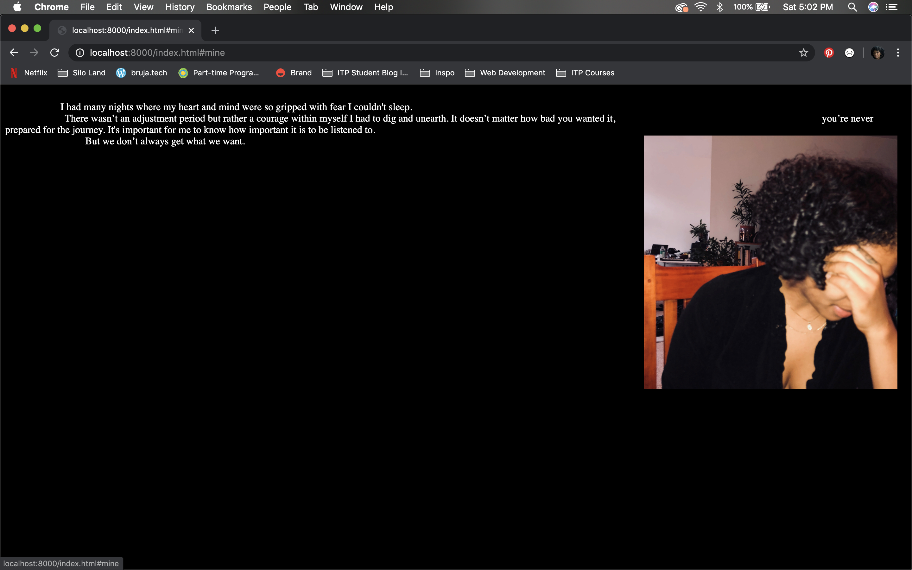
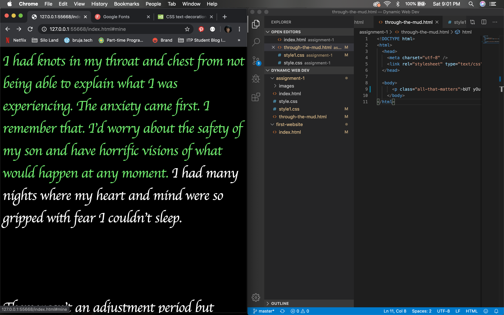
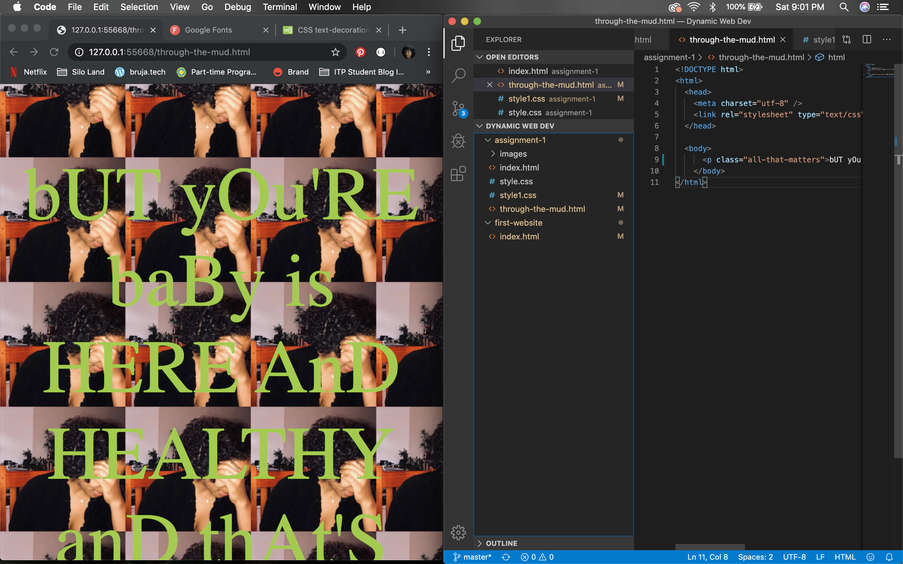
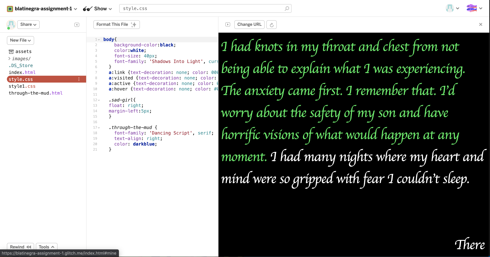
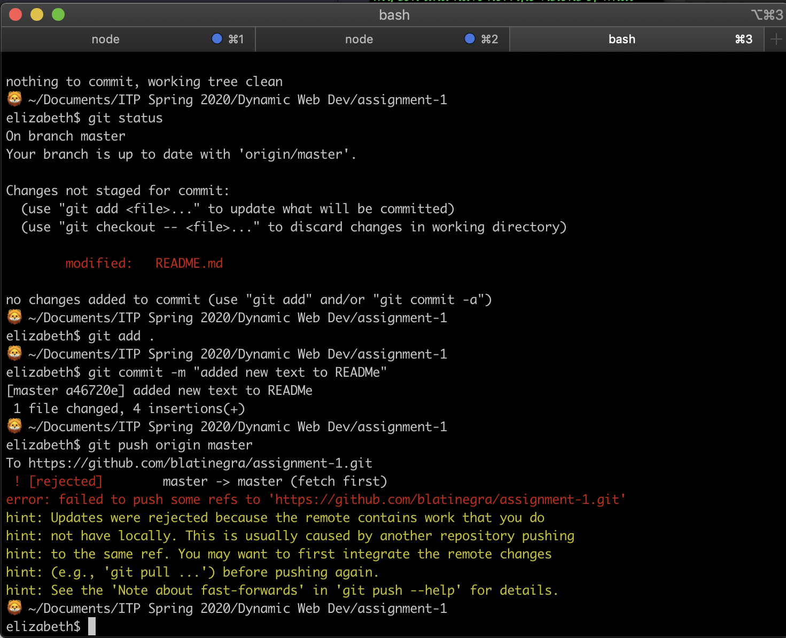

 # Assignment #1
 This assignment was a workflow exercise for my **Dynamic Web Development** class. The goal was to become familiar with the git and deployment process of web developing and with HTML and CSS programming.

 


 ## About
 Inspired by Mendi Obadike's [**<em>keeping up appearances**</em>](http://archive.rhizome.org/artbase/2864/keepingupappearances.html), I built a simple webpage that allowed someone to journey through and understand my postpartum period, namely how I experienced it with postpartum anxiety and depression. What began as me using a blogpost I had written for my [birth work website](https://expectingwonder.com/home/2019/5/5/what-recovering-from-postpartum-anxiety-depression-looks-like) as inspiration, turned into an exploration of text generation using [**Talk Transformer**](https://talktotransformer.com/). Something weird happened: the AI machine eerily mimicked how humans respond to many postpartum birthing individuals. I wanted to demonstrate this by only showing text that didn't exactly state what I was talking about but could be describing any experience. The text I originally wrote and the text generated by the AI machine are intertwined, further showing how the postpartum period is a blur.

 ## Set Up
 This is simple. Run your browser of choice, just make sure its the entire window width and height. You can view my application by [clicking here](https://blatinegra-assignment-1.glitch.me/).

 ### Process & Documentation
 I first began messing with [**Talk Transformer**](https://talktotransformer.com/) to see what it would generate using my original words.



After seeing a few different outputs, I selected a few to include with my original text. I knew I wanted to use a photo my partner took of me while I was depressed and anxious. I didn't know where I wanted it or how but place holding somewhere on the document was like a reminder/inspiration.



To view my changes, I used Python to see the locally. However, I switched to live-server mid-way and it made my workflow much smoother as I didn't have to constantly refresh my browser to view my edits. I also streamlined my workflow by having the browser and VSCode side by side (thanks Yiting for the reminder!).

I ultimately I liked how it looked without the image and decided to make the website interactive by giving viewers a clue to click the blue text, which would take them to the the next page. The ```through-the-mud.html``` page shows the image and the response many postpartum people suffering from anxiety and depression get after they share what they are going through. It is written in upper and lower case to kind of mimic and poke fun at those responses.

 

I'm feeling pretty comfortable with HTML and CSS. Of course, can improve and learn more about the different tags, etc. But this part of the assignment, content creation if you will was, seamless. I've also had a little practice using bash and the terminal so that felt good, too. Deploying to Glitch.com was also pretty seamless as we had practice the process in class.



### Challenges & Struggles
The hard part was this one: READMe! I didn't realize in VSCode you can create an .md file but once I did, I decided to opt for Atom instead. It was really challenging when it came to pushing the file into my gitHub repository. I've been getting error messages when I attempt to this READMe file in the terminal because I deleted the file remotely (on gitHub) then created it locally, or something to that effect. When I tried to push, this is the error I'd get:



### References
- Mendi Obadike, [**<em>keeping up appearances**</em>](http://archive.rhizome.org/artbase/2864/keepingupappearances.html)
- [Talk Transformer](https://talktotransformer.com/)
