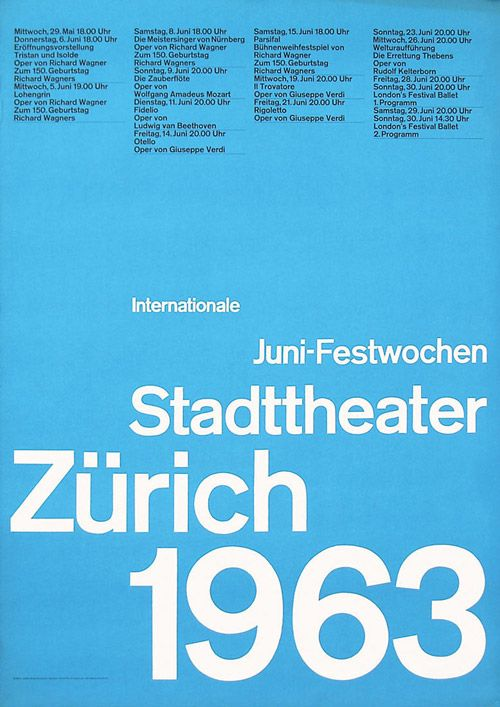
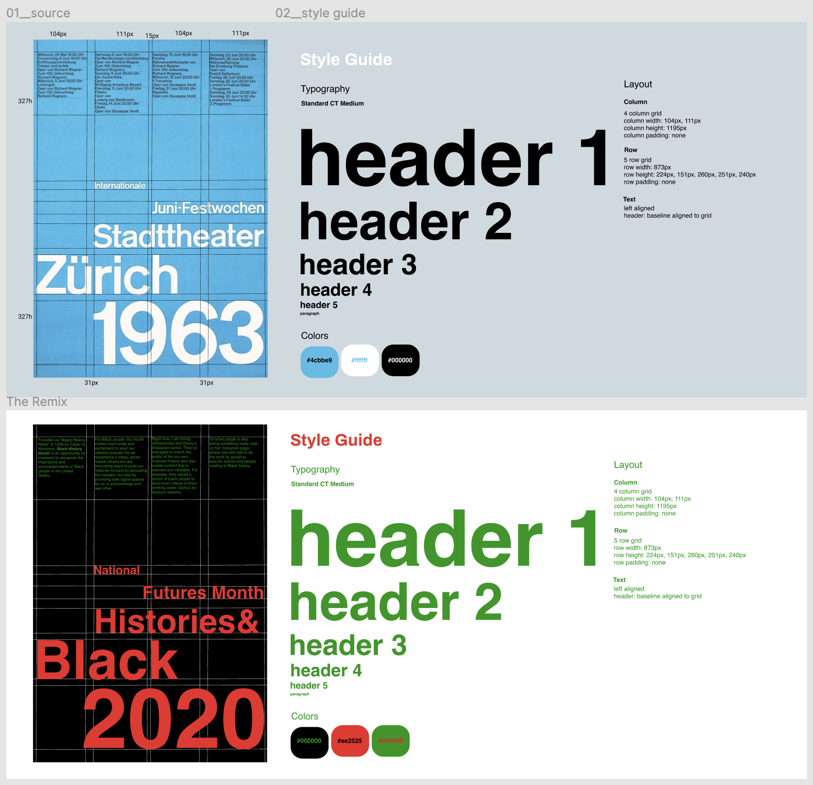
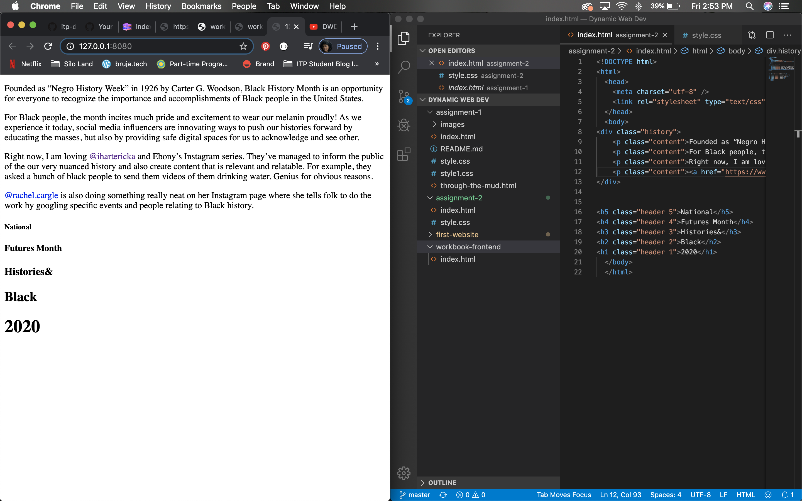
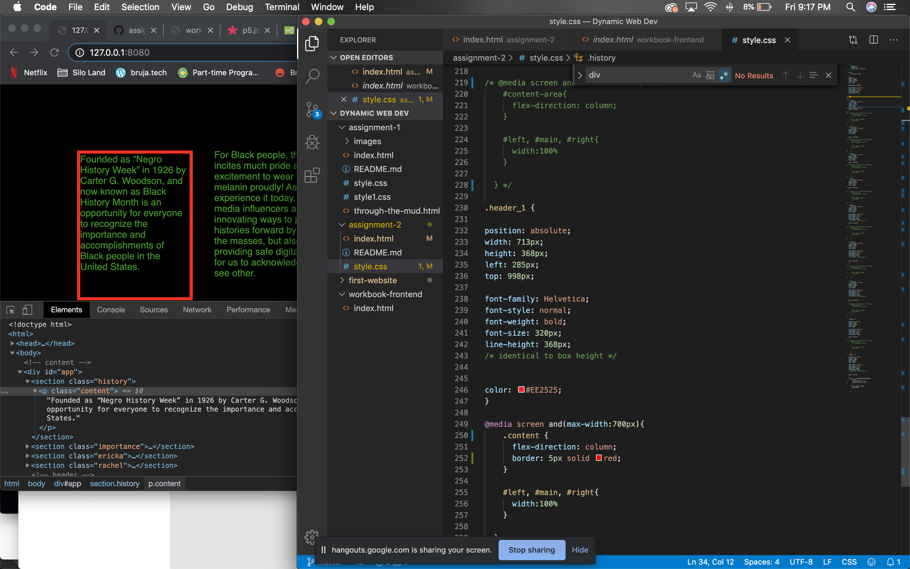
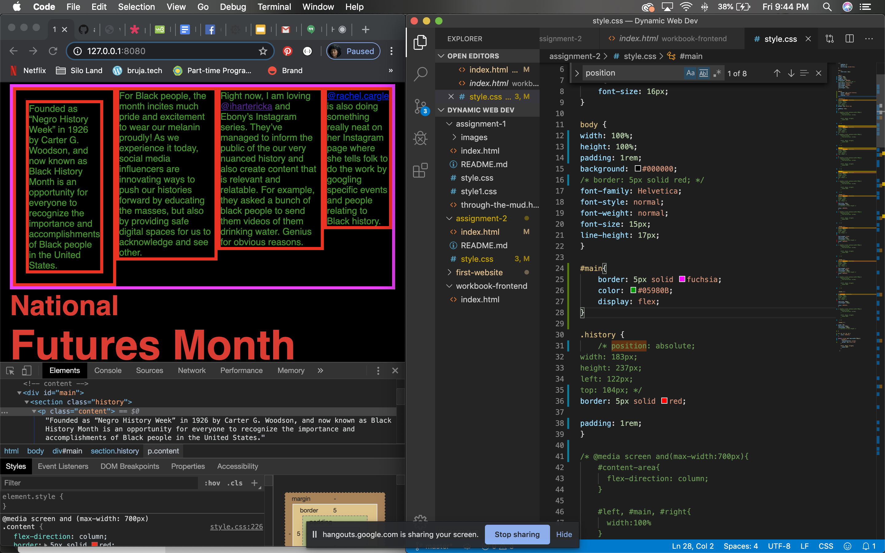
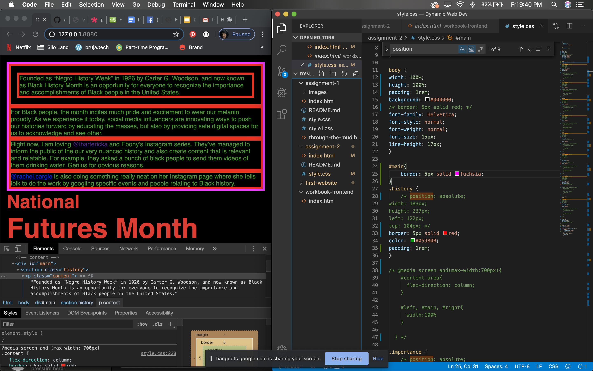
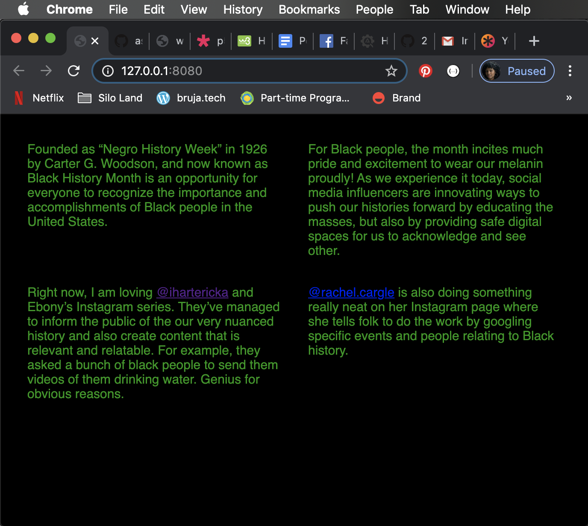

# Assignment #2
The goal of this assignment was to orient us with the process of designing and developing a website inspired by Swiss Poster designs. We first had to define the grid for our chosen Swiss Poster so that we can then create a layout and position all elements exactly how we'd want. This also included organizing the **typography, layout and color** (styling).

## About
I was inspired by Black History Month as the theme for my remixed Swiss Design poster. Easy!

## Set Up
This is simple. You can view this webpage on your device of choice by [clicking here](https://blatinegra-assignment-2.glitch.me/).

### Process & Documentation
I settled on this Swiss Design Poster for this assignment:

It was a really long process to analyze this design as I used figma for the first time. I felt I had to have the perfect grid and wanted to make sure it was all even. However, I learned that every column won't have the exact dimensions but it is in our best interest to get it to look as clean as possible.

To view my Figma sketch, [click here](https://www.figma.com/file/mV3rHv5JxStF0j6fjtJy27/DWD-A2-Swiss-Design).

After finalizing my remix sketch, I moved onto hand-coding my website.  I first began by using getting all of the content withtout styling onto my index.html website first.

Then I used the code Figma provided which were in pixels. I got everything to look exactly how I wanted. However this proved to be a challenge because my website was not responsive. It was static as I kept the position to absolute for all elements. I figured I should first ensure I can isolate the content of the webpage by isolating the first section "history" to ensure my code was 1) working correctly and 2) removing hard the position:absolute and the width/height/left/top pixels and giving a padding of 1rem. I placed a red border around it to see if it worked and it did!

Once I got that working, I then placed all of them  in a parent element (div called main) and thus they would be siblings. I placed a fuscia border around them and also gave it a red border to the other 3 content elements to know that everything was working properly.

 Since I knew hard coding the elements with pixels was not going to make the site responsive, I removed the position and width/height/left/top to all 4 elements.

 

 Next, I decided I wanted the columns to wrap around each other (stack) when the window width was half, so that it would then be a 2 column/2 row display. I used flex wrap for this.

 

### Challenges & Struggles

The tricky part is now making the header texts to be responsive. Since each header is a different header size, I am unsure how to make the sizing adjust/respond to when window width is smaller/user is on a mobile device for example. I know that 1rem=16px but still unsure as to how that translates for header texts. Ideally, I'd like to keep the headers similar in size/experience when making it responsive to not complicate/disrupt the flow of the texts, which is what I think gives this particular design it's umph.

I'm also struggling with the interactivity of the website. I created a separated main.js document and called it into the index.html, correctly. However when I tried to do onload, or click in that document, the website wouldn't fire that interaction. I found that placing it in my index.html document, however, did work. Not sure what I am doing wrong? Also, giving this design is relatively "simple", I am unsure how to make it more interactive with scroll or keypress. I would love ideas!

To view my website on Glitch, [please click here](https://blatinegra-assignment-2.glitch.me).

### References
