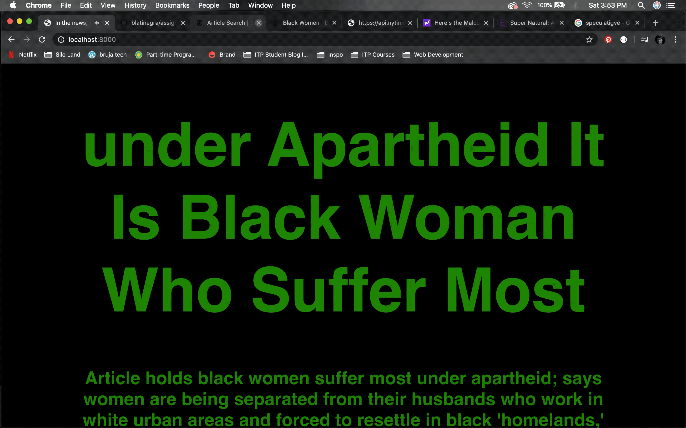
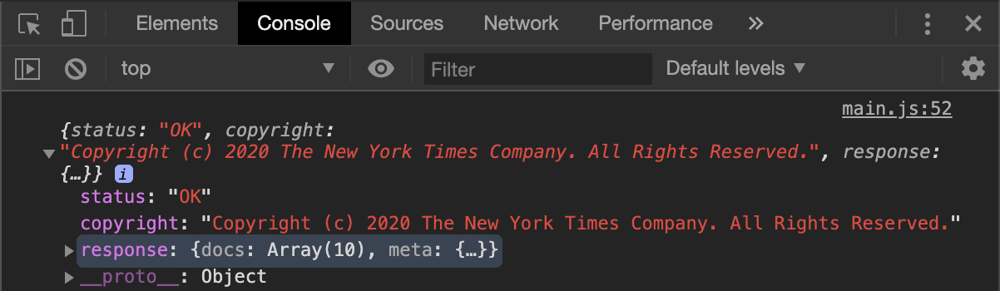
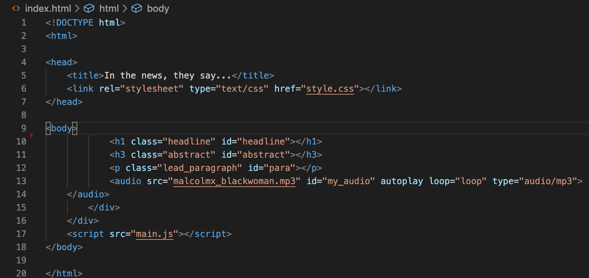
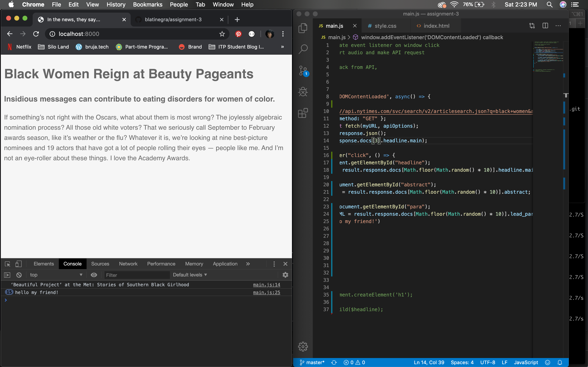
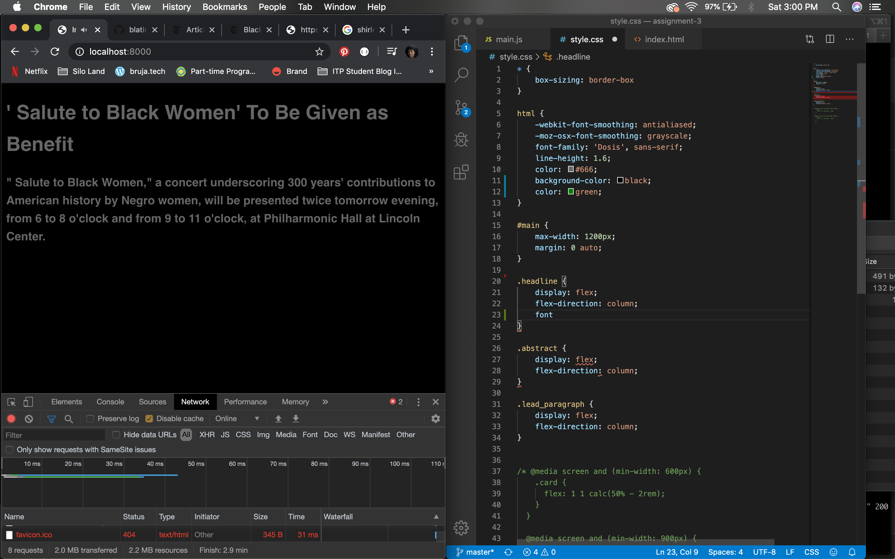
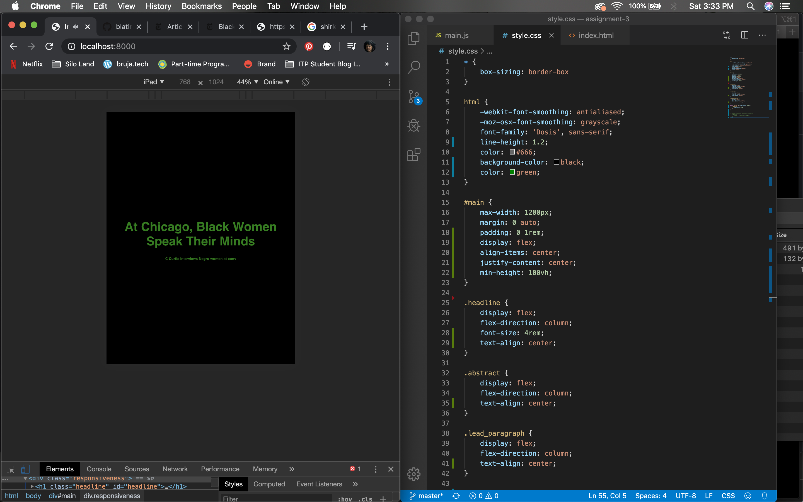

# Assignment #3
For this assignment, we were tasked with creating a web application that connects to an API, includes an interactive element and is responsive to screen size.




## About
It's still February, which means it is still Black History Month! As such, I decided to use the NYTimes Article Search API to demonstrate what was written about and archived (or lack of) about Black women.

I recently re-listened to Malcolm X's speech he gave on May 5, 1962 in Los Angeles where he posed the question, "Who taught you to hate yourself? to his black audience. In this speech he talks about Black women being the most disrespected person in America and how as a people we need to protect Black women. I thought it would be quite interesting to have this speech playing in the background while the API displays articles from 1960-69. In doing so, we are able to see what was being said and also what was saved from these articles. The juxtaposition of an audio that cannot be seen/paused/stopped, and keeps looping, with a cycle of articles evokes a very "in your face" experience for the user.

### Set Up
This is simple. Run your browser of choice, just make sure its the entire window width and height. You can view my application by [clicking here](https://blatinegra-assignment-3.glitch.me/).

### Built with...
* VS Code
* GitHub
* Atom

## Process & Documentation
I began by first sketching out some ideas for how the web app will look.


I decided to go with the second sketch since it seemed like the easiest approach. Next step was connecting the to the NYTimes Article Search API, which was fairly straightforward using fetch. I set my query to "black+women" then set the "begin_date" and "end_date" to January 1, 1960 and December 31, 1969, respectively.



Once the API was up and running, I moved onto creating my DOM elements in my ```index.html``` file. I knew that I wanted an H1, H3 and a P elements to change each time to a new article whenever the user clicked the screen, essentially cycling through the array (10) the API provided. This is my interactive element. I created empty elements that I would call in javascript to perform this action.



I had to add the event listener function to perform the action.
.

However, this is a static interaction. It wasn't changing with each click and so I had to create a random function to cycle through the array. I thought using a for loop would work but all it did was show the user was clicking 10x on the screen. Similarly to how in p5 we can use map to create a new range, I used the ```Math.random()``` function to give me a random article and multiply it by 10. Since the ```Math.random()``` returns a decimal value, by using ```Math.floor()```I am able to get a whole number.

I placed this bit of code inside the index position for each element (headline.main, abstract and lead_paragraph) but what it did was give me random data for each element, not the same article. Instead what I did was turn ```Math.floor(Math.random() * 10``` into a variable ```randomArticle``` and placed that inside the index position. This delivered the correct data for each corresponding article.

I moved on to styling my web application. I chose a black background and green text because #blackhistorymonth, duh! I also used the developer tools to help me understand and see how I wanted my app to look according to which device the user is accessing the app from.

.
.


### Challenges & Struggles
The hardest part of this assignment was getting each DOM element to correspond with the API path. I must of been stuck on this for hours but thankfully I got help from a classmate (Thank you [Cezar](https://cezar.io/)!). After this he showed me how to use ```innerHTML``` and have it be my placeholder for my data.

The second challenge was getting my audio to not appear on the DOM. Because people don't like when things play on their own, Chrome made it difficult for this interaction to happen; and it's exactly what I want to do -- stop someone from pausing or stopping the audio completely. I originally used ```<audio control>``` which did exactly what I didn't want: display a player. I was able to get past this by using auto play instead with my ```<audio src>``` code and calling its id in the javascript file.

I am still trying to understand how to make font-size responsive using percentages and rem. It's quite confusing!

### Next Steps
I would like to include more than 10 items in the array. Not sure how to do this yet since that is the amount the API returns. It'd also be interesting to program the API to go as far back as 1891, but that is a lot of data (over 200k articles mentioned 'Black women')!

### References
* Malcolm X's May 5, 1962 speech delivered in Los Angeles:

  * [Transcript](https://genius.com/Malcolm-x-who-taught-you-to-hate-yourself-annotated)
  * [Video](https://www.youtube.com/watch?v=sCSOiN_38nE)


* New York Times [Developers APIs](https://developer.nytimes.com/apis)
